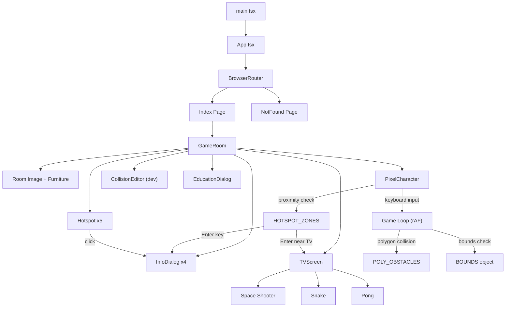

# Portfolio Project Documentation

> **Last Updated:** 2026-05-23  
> **Status:** Active development — Phase 2 complete (TV & Games)

---

## 1. Project Overview

This is an **interactive pixel-art portfolio website** built as a single-page application. The user experience is designed around a **cozy pixel-art room** where a controllable character can walk around and interact with objects — each mapped to a portfolio section or interactive feature.

### Core Concept
- A **pixel-art room** serves as the main (and only) view
- A **controllable character** moves via arrow keys or WASD
- **Hotspot objects** in the room open dialog popups with portfolio content
- A **TV & game console** lets users play 3 retro games (Space Shooter, Snake, Pong)
- An **education certificate** on the wall shows degree & certifications
- A built-in **Collision Editor** (dev-only) supports both rectangle & polygon obstacle editing
- All collisions use **polygon-based ray-casting** for pixel-perfect isometric accuracy

---

## 2. Tech Stack

| Layer | Technology | Version |
|-------|-----------|---------|
| **Framework** | React | 18.3.x |
| **Language** | TypeScript | 5.8.x |
| **Build Tool** | Vite | 5.4.x (SWC plugin) |
| **Styling** | TailwindCSS | 3.4.x |
| **UI Primitives** | shadcn/ui (Radix) | Various |
| **Routing** | React Router DOM | 6.30.x |
| **State (Server)** | TanStack React Query | 5.83.x |
| **Testing** | Vitest + Testing Library | 3.2.x / 16.x |
| **Fonts** | Press Start 2P, VT323 | Google Fonts |
| **Package Manager** | npm / bun | — |

### Dev Server
- **Port:** `8080`
- **Host:** `::` (all interfaces)
- **HMR Overlay:** disabled
- **Path Alias:** `@` → `./src`

---

## 3. Project Structure

```
portfolio/
├── index.html                  # HTML entry, SEO meta, custom favicon
├── package.json                # Dependencies & scripts
├── vite.config.ts              # Vite config: SWC React, path alias, lovable-tagger
├── tailwind.config.ts          # TailwindCSS config: custom tokens, animations
├── tsconfig.json               # TS project references
├── tsconfig.app.json           # App TS config
├── tsconfig.node.json          # Node TS config
├── postcss.config.js           # PostCSS: tailwindcss + autoprefixer
├── components.json             # shadcn/ui config (default style, slate base)
├── vitest.config.ts            # Vitest config
├── eslint.config.js            # ESLint flat config
│
├── public/
│   ├── favicon.ico             # Custom pixel-art game controller icon
│   ├── placeholder.svg
│   └── robots.txt
│
└── src/
    ├── main.tsx                # React root mount
    ├── App.tsx                 # Router, providers (QueryClient, Tooltip, Toasters)
    ├── App.css                 # Minimal global styles
    ├── index.css               # Global styles, CSS variables, custom animations
    ├── vite-env.d.ts           # Vite type declarations
    │
    ├── assets/                 # Pixel-art sprite images (20 files)
    │   ├── room.png            # Main room background (1.5MB)
    │   ├── front_player.png    # Idle sprite - facing down
    │   ├── back_player.png     # Idle sprite - facing up
    │   ├── side_player.png     # Idle sprite - facing side
    │   ├── front_walk_[1-4].png # Walk animation frames - down
    │   ├── back_walk_[1-4].png  # Walk animation frames - up
    │   ├── side_walk_[1-4].png  # Walk animation frames - side
    │   ├── chair.png           # Bean bag chair furniture
    │   └── tv.png              # TV & console furniture
    │
    ├── components/
    │   ├── GameRoom.tsx         # Main room container, hotspots, dialogs, TV zoom, editor
    │   ├── PixelCharacter.tsx   # Player: movement, polygon collision, animation, freeze
    │   ├── TVScreen.tsx         # CRT TV overlay with 3 retro games (canvas-based)
    │   ├── CollisionEditor.tsx  # Dev tool: rect + polygon editor with furniture sizing
    │   ├── EducationDialog.tsx  # Education/certificate dialog with degree + certs
    │   ├── Hotspot.tsx          # Clickable overlay zones (rect or polygon SVG modes)
    │   ├── InfoDialog.tsx       # Themed dialog wrapper for portfolio sections
    │   ├── NavLink.tsx          # React Router NavLink wrapper with className support
    │   └── ui/                  # 49 shadcn/ui primitive components
    │
    ├── hooks/
    │   ├── use-mobile.tsx       # Responsive breakpoint hook (768px)
    │   └── use-toast.ts         # Toast notification hook
    │
    ├── lib/
    │   └── utils.ts             # cn() utility (clsx + tailwind-merge)
    │
    ├── pages/
    │   ├── Index.tsx            # Home page: title + GameRoom + footer hints
    │   └── NotFound.tsx         # 404 page
    │
    └── test/
        ├── setup.ts             # Test setup (jsdom, jest-dom matchers)
        └── example.test.ts      # Example test
```

---

## 4. Architecture & Data Flow



### Provider Hierarchy
```
QueryClientProvider → TooltipProvider → Toaster + Sonner → BrowserRouter → Routes
```

---

## 5. Custom Components (Detail)

### 5.1 `GameRoom.tsx`
**The orchestrator component.** Renders the room image, furniture overlays, hotspot buttons, the player character, all info dialogs, the TV screen overlay, and the collision editor toggle.

- **State:** `activeSection`, `showEditor`, `showTV`, `isZooming`, `spriteSize`, `walkSpriteSize`, `furniture`
- **Sections:** `"about" | "projects" | "skills" | "contact" | "education" | "tv" | null`
- **Furniture:** Array of `FurnitureItem` objects (TV & Console, Bean Bag Chair) positioned via CSS percentages
- **TV Interaction:** Smooth fade-to-black transition → CRT power-on animation → game overlay
- **Character Freeze:** Passes `frozen={isZooming || showTV}` to disable movement during TV interaction
- **Hotspots:** 5 clickable zones overlaid on the room image:
  - Computer → About Me (top: 38%, left: 32%)
  - Bookshelf → Skills (top: 18%, left: 12%)
  - Wall Frames → Projects (top: 20%, left: 66%)
  - Bed → Contact (top: 42%, left: 62%)
  - Certificate → Education (polygon: right wall)
  - TV & Console → Game Screen (top: 62%, left: 1%)

### 5.2 `PixelCharacter.tsx`
**The character controller.** Handles movement, animation, polygon collision detection, hotspot proximity, and freeze state.

| Feature | Details |
|---------|---------|
| **Movement** | Arrow keys + WASD, `SPEED = 0.8` per frame |
| **Directions** | `"up" | "down" | "left" | "right"` |
| **Idle Sprites** | 3 unique images (front, back, side); left = flipped side |
| **Walk Animation** | 4 frames per direction, `150ms` per frame |
| **Walk-on-wall fix** | Walk animation only plays when position actually changes (no hovering in place) |
| **Start Position** | `x: 48, y: 75` (percentage-based) |
| **Collision** | Ray-casting point-in-polygon vs `POLY_OBSTACLES` (12 polygons) |
| **Bounds** | Walkable area: X 2–98%, Y 54–97% |
| **Hotspot Zones** | 5 proximity circles (education r=8, tv r=10, others r=10) |
| **Interaction** | Enter/Space when near a hotspot triggers dialog |
| **Frozen prop** | `frozen` boolean disables all input (used during TV interaction) |
| **Image Preload** | All 15 sprites preloaded at module level to prevent flicker |
| **Rendering** | CSS grid stacking (grid-area: 1/1) with visibility toggle |
| **Shadow** | Elliptical black/25% shadow rendered below character |

**Exported Constants:**
- `OBSTACLES` — Empty array (legacy, kept for type compatibility)
- `POLY_OBSTACLES` — 12 polygon shapes with ray-casting collision
- `BOUNDS` — walkable area boundaries

### 5.3 `TVScreen.tsx`
**The retro game console interface.** Full-screen overlay with CRT TV effects and 3 playable canvas-based games.

| Feature | Details |
|---------|---------|
| **CRT Effects** | Scanline overlay, screen curvature vignette, inner glow |
| **Power-on Animation** | TV frame expands from thin line to full size (500ms ease-out) |
| **Background** | Smooth fade from transparent to 92% black |
| **Game Menu** | 3 buttons: Space Shooter (cyan), Snake (green), Pong (yellow) |
| **ESC Navigation** | ESC returns to menu from game, ESC from menu closes TV |
| **Game Reset** | Games reset to menu state when TV is closed/reopened |

**Games:**

| Game | Controls | Features |
|------|----------|----------|
| **Space Shooter** | ← → move, SPACE shoot | Enemy waves, scoring, lives, explosions, difficulty scaling |
| **Snake** | Arrow keys / WASD | Wrap-around edges, growing snake, speed increase every 50pts |
| **Pong** | ↑ ↓ / W S paddle | AI opponent, ball physics with angle control, first to 7 wins |

### 5.4 `CollisionEditor.tsx`
**A developer tool** (dev-only) for visually editing collision shapes, walkable bounds, player collision, sprite sizes, and furniture positions.

- **6 Tabs:** 🧱 Boxes, ✏️ Polygons, 🟩 Bounds, 🧑 Player, 🖼️ Sprite, 🪑 Furniture
- **Polygon Tool:** Click to place vertices, drag to reshape, right-click to add vertex on edge, delete to remove vertex
- **Furniture Tab:** Range sliders for Left (0-100%), Top (0-100%), Size (2-30%) + numeric inputs
- **Drag & Resize:** Full pointer-event-based drag system with move, edge, and corner resize handles
- **Export:** "Copy All" generates `OBSTACLES`, `POLY_OBSTACLES`, `BOUNDS`, character size, furniture positions
- **Labels:** Inline text input for naming obstacles/polygons (exported as comments)
- **Keyboard:** Delete/Backspace removes selected shape, Escape deselects

### 5.5 `Hotspot.tsx`
Clickable overlay with two rendering modes:
- **Rectangle mode:** `top`, `left`, `width`, `height` props for standard rectangular areas
- **Polygon mode:** `polygonPoints` SVG path string for irregular shapes (e.g., isometric certificate)
- Warm golden glow effect via `isGlowing` prop when player is nearby
- Floating `✦` star pseudo-element on hover

### 5.6 `InfoDialog.tsx`
Thin wrapper around shadcn's `Dialog` component with the retro theme applied:
- Dark brown background (`hsl(25 25% 15%)`)
- Primary-colored border with warm glow shadow
- Pixel font title with emoji icon
- VT323 monospace body text

### 5.7 `EducationDialog.tsx`
Education-specific dialog showing degree information and certifications with placeholder data.

### 5.8 `NavLink.tsx`
Wrapper around React Router's `NavLink` that supports `className`, `activeClassName`, and `pendingClassName` string props.

---

## 6. Design System

### 6.1 Color Palette (HSL CSS Variables)

| Token | HSL Value | Description |
|-------|-----------|-------------|
| `--background` | `30 25% 12%` | Dark warm brown |
| `--foreground` | `35 30% 85%` | Light cream text |
| `--primary` | `25 55% 45%` | Warm amber/brown |
| `--secondary` | `30 20% 22%` | Darker brown |
| `--accent` | `120 30% 35%` | Muted green (pixel-art style) |
| `--muted` | `30 15% 20%` | Subdued brown |
| `--warm-glow` | `40 70% 55%` | Golden highlight |
| `--night-sky` | `220 50% 20%` | Deep blue |
| `--pixel-green` | `120 40% 40%` | Retro green |
| `--wood-dark` | `25 40% 25%` | Dark wood |
| `--wood-light` | `30 35% 55%` | Light wood |
| `--cream` | `35 35% 82%` | Warm cream |

### 6.2 Typography
- **`font-pixel`** — `'Press Start 2P'` (headings, labels, UI elements)
- **`font-retro`** — `'VT323'` (body text, descriptions — also the base font)
- **`--radius`** — `0.25rem` (sharp, pixel-art-appropriate corners)

### 6.3 Animations

| Class | Keyframes | Duration | Purpose |
|-------|-----------|----------|---------|
| `animate-twinkle` | opacity 0.4↔1 | 2s infinite | Twinkling elements |
| `animate-float` | translateY 0↔-6px | 3s infinite | Floating effect |
| `animate-pulse-glow` | box-shadow glow | 2s infinite | Warm glow pulse |
| `animate-fade-in` | opacity + translateY | 0.5s ease-out | Page entry |
| `animate-scale-in` | scale 0.95→1 + opacity | 0.6s, 0.2s delay | Delayed scale entry |

### 6.4 Hotspot Styles
- Cursor pointer with brightness/drop-shadow on hover
- Floating `✦` star pseudo-element on hover
- Smooth 0.2s–0.3s transitions

---

## 7. Sprite & Animation System

### 7.1 Sprite Assets (20 files in `src/assets/`)

| Category | Files | Notes |
|----------|-------|-------|
| **Room Background** | `room.png` (1.5MB) | Main scene |
| **Idle Sprites** | `front_player.png`, `back_player.png`, `side_player.png` | 3 directions (left = mirrored side) |
| **Walk Down** | `front_walk_[1-4].png` | 4-frame animation |
| **Walk Up** | `back_walk_[1-4].png` | 4-frame animation |
| **Walk Side** | `side_walk_[1-4].png` | 4-frame animation (mirrored for left) |
| **Furniture** | `chair.png`, `tv.png` | Positioned via percentage |

### 7.2 Animation Approach
- **No sprite sheets** — individual PNGs per frame
- **All images preloaded** at module level via `Promise.all` + `new Image()`
- **Frame cycling** via `setInterval` at 150ms intervals
- **Rendering:** All frames rendered in a CSS Grid stack (`grid-area: 1/1`), toggling `visibility` to avoid layout shifts
- **Separate containers** for idle vs walking states (toggled via `display: none/grid`)

---

## 8. Collision & Physics

### 8.1 Movement System
- **Game loop:** `requestAnimationFrame` at ~60fps (16ms threshold)
- **Input:** Keyboard state tracked via `Set<string>` in a ref
- **Speed:** 0.8% per frame
- **Axis resolution:** If diagonal movement hits an obstacle, each axis is tried independently (slide along walls)
- **Walk animation guard:** Animation only plays when position actually changes — standing against a wall shows idle sprite
- **Freeze state:** `frozen` prop completely disables input during TV interaction

### 8.2 Collision Detection
- **Primary:** Ray-casting **point-in-polygon** algorithm for `POLY_OBSTACLES`
- **Legacy:** AABB support remains for `OBSTACLES` array (currently empty)
- **Player hitbox:** `halfW=6`, `heightFactor=0.5` — 4 test points (center + edges)
- **12 polygon obstacles** covering all room furniture in isometric perspective:

| # | Label | Vertices |
|---|-------|----------|
| 0 | Certificate | 4 pts — right wall frame |
| 1 | Desk 1 | 6 pts — main desk area |
| 2 | Desk 2 | 4 pts — desk upper section |
| 3 | Bed | 6 pts — full bed outline |
| 4 | Plant | 5 pts — right plant |
| 5 | Plant 2 | 5 pts — left plant |
| 6 | TV | 12 pts — TV console (complex shape) |
| 7 | Bean chair | 6 pts — bean bag chair |
| 8 | Shelf | 7 pts — full bookshelf |
| 9 | Desk corner | 3 pts — triangular desk corner |
| 10 | Wall right | 4 pts — right wall boundary |
| 11 | Wall left | 4 pts — left wall boundary |

- **Walkable bounds:** X: 2–98%, Y: 54–97%

### 8.3 Hotspot Proximity
- 5 circular zones:
  - `projects` (x:74, y:60, r:10), `contact` (x:80, y:70, r:10)
  - `education` (x:90, y:62, r:8), `tv` (x:10, y:78, r:10)
- Distance calculated via Euclidean formula
- Shows "Press ENTER" floating prompt when in range
- Glow effect on associated Hotspot component when nearby

---

## 9. Portfolio Content (Current Placeholder Data)

### About Me
- Generic developer intro
- Tech tags: React, TypeScript, Node.js

### Skills (Progress Bars)
| Skill | Level |
|-------|-------|
| Frontend | 90% |
| Backend | 75% |
| Design | 70% |
| DevOps | 60% |

### Projects (3 Cards)
| Project | Description | Tech |
|---------|-------------|------|
| Pixel Quest | 2D adventure game | JS, Canvas |
| RetroChat | Real-time chat app | React, WebSocket |
| CodeForge | Online code editor | TS, Monaco |

### Contact
| Channel | Value |
|---------|-------|
| Email | hello@developer.dev |
| GitHub | github.com/developer |
| Twitter | @developer |

> [!IMPORTANT]
> All portfolio content is placeholder data. Needs to be replaced with real personal information.

---

## 10. Routes

| Path | Component | Description |
|------|-----------|-------------|
| `/` | `Index` | Home — title + interactive room |
| `*` | `NotFound` | 404 catch-all |

---

## 11. shadcn/ui Components (49 installed)

The full shadcn/ui library is installed under `src/components/ui/`. All are standard, unmodified primitives:

`accordion` · `alert-dialog` · `alert` · `aspect-ratio` · `avatar` · `badge` · `breadcrumb` · `button` · `calendar` · `card` · `carousel` · `chart` · `checkbox` · `collapsible` · `command` · `context-menu` · `dialog` · `drawer` · `dropdown-menu` · `form` · `hover-card` · `input-otp` · `input` · `label` · `menubar` · `navigation-menu` · `pagination` · `popover` · `progress` · `radio-group` · `resizable` · `scroll-area` · `select` · `separator` · `sheet` · `sidebar` · `skeleton` · `slider` · `sonner` · `switch` · `table` · `tabs` · `textarea` · `toast` · `toaster` · `toggle-group` · `toggle` · `tooltip` · `use-toast`

> [!NOTE]
> Most of these are not currently used in the application. Only `dialog`, `toaster`, `sonner`, and `tooltip` are actively imported.

---

## 12. Known TODOs & Issues

- [x] ~~**`index.html`** — Title, meta tags, and OG images had Lovable placeholder values~~ ✅ Fixed 2026-05-23
- [x] ~~**`App.css`** — Contained legacy Vite template styles (unused)~~ ✅ Cleaned up 2026-05-23
- [x] ~~**Collision Editor** — Visible "Edit Collisions" button in production~~ ✅ Now dev-only 2026-05-23
- [x] ~~**Contact links** — No actual `href` links on contact items~~ ✅ Now proper `<a>` tags 2026-05-23
- [x] ~~**Project links** — Project cards were not clickable/linkable~~ ✅ Now `<a>` tags with `target="_blank"` 2026-05-23
- [ ] **Portfolio content** — All sections contain placeholder data (waiting for user's real info)
- [ ] **Mobile support** — `use-mobile` hook exists but the game requires keyboard input; no touch controls implemented
- [ ] **Accessibility** — Character movement relies entirely on keyboard; no screen reader support for the interactive room

---

## 13. Scripts

```bash
npm run dev        # Start dev server on port 8080
npm run build      # Production build
npm run build:dev  # Development build
npm run preview    # Preview production build
npm run lint       # ESLint
npm run test       # Vitest (single run)
npm run test:watch # Vitest (watch mode)
```

---

## 14. Changelog

Track of features added/modified during development sessions:

| Date | Feature | Status | Notes |
|------|---------|--------|-------|
| 2026-05-23 | Initial documentation scan | ✅ Done | Codebase fully documented |
| 2026-05-23 | Remove Lovable branding from `index.html` | ✅ Done | Title, meta, OG tags updated |
| 2026-05-23 | Clean up `App.css` | ✅ Done | Removed all unused legacy Vite styles |
| 2026-05-23 | Make CollisionEditor dev-only | ✅ Done | Wrapped in `import.meta.env.DEV` check |
| 2026-05-23 | Add links to contact items | ✅ Done | `<div>` → `<a>` with `href`, `target="_blank"` |
| 2026-05-23 | Make project cards clickable | ✅ Done | `<div>` → `<a>` with `href`, `target="_blank"` |
| 2026-05-23 | Phase 1: Certificate Wall | ✅ Done | Generated pixel-art certificate, EducationDialog, hotspot zone, furniture item |
| 2026-05-23 | Fix: Remove generated certificate | ✅ Done | Removed out-of-theme image, repositioned hotspot to existing room art certificate on right wall |
| 2026-05-23 | Glow proximity indicator | ✅ Done | Hotspots glow warm gold when player walks near; `isGlowing` prop + `onNearHotspot` callback |
| 2026-05-23 | Fix: Reposition education hotspot | ✅ Done | Moved to actual right-wall certificate (top:49%, left:89%, 5%×7%) |
| 2026-05-23 | CollisionEditor: label editing | ✅ Done | Inline text input in toolbar when obstacle selected; labels exported with code |
| 2026-05-23 | CollisionEditor: polygon tool | ✅ Done | Full polygon draw/edit system: click-to-place vertices, drag to reshape, add/remove vertices, SVG overlay, export as POLY_OBSTACLES |
| 2026-05-23 | Polygon hotspot support | ✅ Done | Hotspot component accepts `polygonPoints` prop for non-rectangular glow/click zones (SVG-based) |
| 2026-05-23 | Certificate polygon collision | ✅ Done | Certificate uses polygon obstacle + polygon hotspot for pixel-perfect isometric matching |
| 2026-05-23 | Point-in-polygon collision | ✅ Done | Ray-casting algorithm in PixelCharacter for POLY_OBSTACLES array |
| 2026-05-23 | Phase 2: TV & Game Console | ✅ Done | New isometric TV/console + bean bag sprites, transparency-fixed PNGs, TV hotspot zone |
| 2026-05-23 | TVScreen component | ✅ Done | CRT TV frame with scanlines, screen glow, curvature effects. Game menu |
| 2026-05-23 | Space Shooter game | ✅ Done | Canvas-based game: ship movement, shooting, enemy waves, explosions, score/lives/wave system |
| 2026-05-23 | TV zoom transition | ✅ Done | Smooth CSS transform zoom into TV area before overlay appears, zoom-out on exit |
| 2026-05-23 | Walk-on-wall fix | ✅ Done | Walk animation stops when character is blocked (checks actual position delta) |
| 2026-05-23 | TV transition redesign | ✅ Done | Replaced jarring scale zoom with smooth opacity fade + CRT power-on animation |
| 2026-05-23 | Character freeze | ✅ Done | `frozen` prop disables WASD/arrow movement during TV interaction |
| 2026-05-23 | Bean bag re-generation | ✅ Done | New asset facing upper-left toward TV, transparent bg, no wooden platform |
| 2026-05-23 | Favicon replacement | ✅ Done | Custom pixel-art game controller icon replaces Lovable favicon |
| 2026-05-23 | Furniture editor sliders | ✅ Done | Range sliders for Left, Top, Size (%) in Furniture tab of CollisionEditor |
| 2026-05-23 | Snake game | ✅ Done | Arrow/WASD controls, wrap-around, growing snake, speed scaling, grid overlay |
| 2026-05-23 | Pong game | ✅ Done | Single-player vs AI, paddle physics, ball angle control, neon glow, first-to-7 |
| 2026-05-23 | Full polygon collisions | ✅ Done | All 12 obstacles now polygon-based (OBSTACLES array emptied) |

---

## 15. Roadmap & Next Steps

| Phase | Feature | Status |
|-------|---------|--------|
| Phase 3 | Desktop Shell — WindowManager + virtual apps (VS Code, Terminal, Steam, Discord) | 🔜 Next |
| Phase 3 | Interactive Terminal — Linux command simulation with real output | 🔜 Planned |
| Refinement | Replace placeholder portfolio data with real info | ⏳ Waiting |
| Refinement | Mobile/touch controls | ⏳ Planned |
| Refinement | Character sit animation when interacting with TV | ⏳ Optional |

---

*This document will be updated as new features are implemented.*
