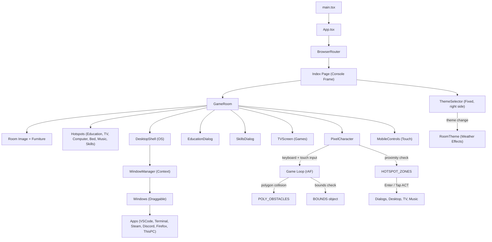

# Portfolio Project Documentation

> **Last Updated:** 2026-05-26  
> **Status:** Active development — Phase 5 complete (Polish & Mobile)

---

## 1. Project Overview

This is an **interactive pixel-art portfolio website** built as a single-page application. The user experience is designed around a **cozy pixel-art room** where a controllable character can walk around and interact with objects — each mapped to a portfolio section or interactive feature.

### Core Concept
- A **pixel-art room** serves as the main view, wrapped in a retro **"PORTFOLIO BOY"** console frame
- A **controllable character** moves via arrow keys, WASD, or **mobile touch D-pad**
- A **TV & game console** lets users play retro games
- An **education certificate** on the wall shows degree & certifications
- A **skills shelf** hotspot displays organized skill/technology logos by category
- A **music hotspot** toggles ambient background music (`music.mp3`)
- A built-in **Collision Editor** (dev-only) supports polygon obstacle editing
- All collisions use **polygon-based ray-casting** for pixel-perfect isometric accuracy
- A full **Desktop Shell OS** interface simulating a computer with draggable windows and apps (Terminal, VS Code, Steam, Discord, Firefox, This PC)
- **Firefox app** contains high-fidelity replicas of the user's LinkedIn and GitHub profiles, with a global "OPEN" redirect button in the URL bar
- **5 room themes** (Night, Sunny, Rainy, Snowy, RGB) with weather effects, all locked to a consistent aspect ratio for hotspot alignment

---

## 2. Tech Stack

| Layer | Technology | Version |
|-------|-----------|---------|
| **Framework** | React | 18.3.x |
| **Language** | TypeScript | 5.8.x |
| **Build Tool** | Vite | 5.4.x (SWC plugin) |
| **Styling** | TailwindCSS | 3.4.x |
| **UI Primitives** | shadcn/ui (Radix) | Various |
| **Routing** | React Router DOM | 6.30.x |
| **State (Server)** | TanStack React Query | 5.83.x |
| **Fonts** | Press Start 2P, VT323 | Google Fonts |
| **Skill Icons** | Devicons CDN | Latest |

---

## 3. Project Structure

```text
portfolio/
├── index.html                  
├── package.json                
├── vite.config.ts              
├── tailwind.config.ts          
├── tsconfig.json               
├── music.mp3                   # Ambient background music file
├── src/
    ├── main.tsx                
    ├── App.tsx                 
    ├── index.css               # Global styles, body overflow, animations
    │
    ├── assets/                 # Pixel-art sprites, room themes, app icons, user portrait
    │   ├── room.png            # Default room (1025×934)
    │   ├── room_sunny.png      # Sunny theme (1024×1024, stretched to match)
    │   ├── room_rainy.png      # Rainy theme (1024×1024, stretched to match)
    │   ├── room_snowy.png      # Snowy theme (1024×1024, stretched to match)
    │   ├── room_rgb.png        # RGB theme (1024×1024, stretched to match)
    │   ├── my_pic.png          # User's portrait (used in Firefox LinkedIn/GitHub)
    │   ├── icons/              # Game library icons
    │   └── splash art/         # Game library splash art
    │
    ├── components/
    │   ├── GameRoom.tsx         # Main room container, hotspots, dialogs, collision editor, music
    │   ├── PixelCharacter.tsx   # Player: movement, polygon collision, animation, freeze, touch input
    │   ├── TVScreen.tsx         # CRT TV overlay with retro games
    │   ├── CollisionEditor.tsx  # Dev tool: rect + polygon editor with furniture sizing
    │   ├── EducationDialog.tsx  # Education/certificate dialog (degree + 7 certifications)
    │   ├── SkillsDialog.tsx     # Skills & Technologies dialog (5 categories, devicon logos)
    │   ├── Hotspot.tsx          # Clickable overlay zones (rect or polygon SVG modes)
    │   ├── RoomTheme.tsx        # Weather overlays (rain, snow, sun, RGB) + rain sound
    │   ├── ThemeSelector.tsx    # Vertical theme picker (5 themes)
    │   ├── MobileControls.tsx   # Touch D-pad + action button for mobile devices
    │   ├── DesktopShell/        # OS Simulation Environment
    │   │   ├── DesktopShell.tsx # Main OS UI (desktop, icons, start menu)
    │   │   ├── WindowManager.tsx# Context provider for managing window states
    │   │   ├── Window.tsx       # Draggable/resizable window component
    │   │   ├── Taskbar.tsx      # Bottom taskbar with active apps
    │   │   ├── DesktopIcon.tsx  # Clickable desktop shortcut
    │   │   ├── apps/            # Virtual applications
    │   │   │   ├── FirefoxApp.tsx   # Browser with LinkedIn/GitHub replicas + OPEN redirect
    │   │   │   ├── SteamApp.tsx     # Game library, store, community, downloads
    │   │   │   ├── DiscordApp.tsx   # Chat simulation
    │   │   │   ├── VSCodeApp.tsx    # Code editor simulation
    │   │   │   ├── TerminalApp.tsx  # Linux CLI simulation
    │   │   │   └── ThisPCApp.tsx    # File explorer
    │   │   └── terminal/        # Terminal simulation commands logic
    │   └── ui/                  # shadcn/ui primitive components
    │
    ├── pages/
    │   ├── Index.tsx            # Home page — retro console frame + room + fixed theme selector
    │   └── NotFound.tsx         # 404 page
```

---

## 4. Architecture & Data Flow



---

## 5. Custom Components (Detail)

### 5.1 `GameRoom.tsx`
**The orchestrator component.** Renders the room image, furniture overlays, hotspot buttons, the player character, info dialogs, the TV screen, the Desktop Shell, and mobile controls.
- **Furniture:** Positioned via CSS percentages (TV at 61% top, Bean Bag at 4.4% left / 68.4% top).
- **Hotspots:** 6 interactive zones — Education, TV, Computer (Desktop), Bed (Sleep), Music, Skills.
- **Music:** `<audio>` element plays `music.mp3` at volume 0.15 when toggled via the music hotspot.
- **Room Image:** Locked to `aspect-ratio: 1025/934` with `object-fit: fill` to ensure hotspot alignment across all themes.

### 5.2 `PixelCharacter.tsx`
**The character controller.** Handles movement, animation, polygon collision detection, hotspot proximity, freeze state, and external touch input.
- **Bounds:** Walkable area (X 1–97%, Y 59–99%).
- **Obstacles:** 3 rect obstacles (Bookshelf, Music setup, Skills shelf) + 9 polygon obstacles.
- **Hotspot Zones:** `education` (85,67 r10), `tv` (9,75 r10), `computer` (48,68 r10), `bed` (75,72 r10), `music` (66,60 r8), `skills` (24,62 r8).
- **Touch Support:** Accepts `externalKeys` prop to merge mobile D-pad input with keyboard input.

### 5.3 `DesktopShell` & `WindowManager`
A full operating system simulation environment accessed by interacting with the computer.
- **WindowManager:** React Context managing the state of all open windows (Z-index, maximized, minimized, dimensions, positions).
- **DesktopShell:** Renders the background, desktop icons, start menu, context menu (right-click), and taskbar.
- **Window:** A draggable and resizable container for virtual apps.
- **Apps:**
  - **Terminal:** Interactive Linux-style CLI.
  - **VS Code:** Code editor simulation.
  - **Steam:** Full Steam UI replica — Library (with user-provided icons/splash art), Store, Community, Downloads.
  - **Discord:** Chat simulation.
  - **Firefox:** Browser with custom LinkedIn & GitHub profile replicas using user's portrait. Global "↗ OPEN" button in URL bar redirects to real sites.
  - **This PC:** File explorer simulation.

### 5.4 `SkillsDialog.tsx`
Displays skills & technologies organized into 5 categories with color-coded headers and devicon SVG logos:
1. **Languages** (orange) — C, C++, Python, JS, TS, PHP, Bash, PowerShell, HTML5, CSS3
2. **Frameworks & Libraries** (blue) — React, Next.js, Node.js, Express, Django, FastAPI, Angular, Vite, jQuery, Bootstrap
3. **Databases** (red) — Oracle, PostgreSQL, MongoDB, MySQL, SQLite, MS SQL, Redis
4. **Cloud & DevOps** (purple) — AWS, Azure, Firebase, GCP, Docker, Git, Linux, CircleCI
5. **Automation & Tools** (green) — n8n, OpenClaw, Selenium, Puppeteer, Postman, WebLogic, Nginx, Jinja

### 5.5 `MobileControls.tsx`
Touch-friendly controls that only render on touch-capable devices:
- **D-Pad** (bottom-left) — 4 directional buttons with touch start/end events.
- **ACT Button** (bottom-right) — Glows when near a hotspot, triggers interaction on tap.
- Uses glassmorphism styling to match the retro theme.

### 5.6 `RoomTheme.tsx` & `ThemeSelector.tsx`
- **5 Themes:** Night (default), Sunny, Rainy, Snowy, RGB.
- **Weather Effects:** Rain particles + rain sound (Web Audio API noise), snow particles, sun rays + dust, RGB LED glow.
- **Theme Filter:** Each theme applies a CSS filter to the room image (brightness, saturation, hue-rotate).
- **Aspect Ratio Fix:** Theme images are 1024×1024 (square) vs default 1025×934. Fixed via locked `aspect-ratio` container + `object-fit: fill`.

### 5.7 `Index.tsx` — Console Frame Layout
The page wraps the room in a retro **"PORTFOLIO BOY"** console frame:
- **Top bar:** Power LED (animated pulse), branding, decorative speaker holes.
- **Side edges:** Thin decorative borders with Phillips-head screw details.
- **Bottom bar:** SELECT/START buttons, model info, LINK port.
- **Room:** Centered with `max-width: min(1100px, calc((100vh - 120px) * 1.78))` to fit 1366×768 and 1080p.
- **Welcome overlay:** Transparent gradient with title + instructions (desktop/mobile variants).
- **Theme selector:** Fixed position right side, always visible, vertical layout.

---

## 6. Collision & Physics

### 6.1 Collision Detection
- **Primary:** Ray-casting **point-in-polygon** algorithm for `POLY_OBSTACLES`.
- **3 rectangular obstacles:** Bookshelf upper, Music setup, Skills shelf.
- **9 polygon obstacles** covering all room furniture in isometric perspective:
  1. Certificate
  2. Bed
  3. Desk
  4. Plant
  5. Shelf
  6. TV
  7. Chair
  8. Wall (right)
  9. Desk corner (small triangular bound)

---

## 7. Education & Certifications

| Certification | Issuer | Year |
|---------------|--------|------|
| CS50x — Introduction to Computer Science | Harvard University | 2022 |
| Advanced Full-Stack Web Nanodegree | Udacity | 2022 |
| Full-Stack Web Development | Udemy | 2023 |
| Web Development Bootcamp | DEPI | 2024 |
| CCNA — Networking Basics | Cisco | 2023 |
| Oracle Database Administration | Oracle | 2025 |
| Oracle MiddleWare Administration | Oracle | 2025 |

**Degree:** Bachelor's Degree in International Foreign Trade — English Department, Helwan University, Cairo (2015–2019)

---

## 8. Roadmap & Milestones

| Phase | Feature | Status |
|-------|---------|--------|
| Phase 1 | Room, Character, Hotspots, Collisions | ✅ Done |
| Phase 2 | TV & Games (Space Shooter, Snake, Pong) | ✅ Done |
| Phase 3 | Desktop Shell & Virtual Apps (WindowManager, Terminal) | ✅ Done |
| Phase 4 | Steam Library, Firefox (LinkedIn/GitHub), Skills Dialog, Music | ✅ Done |
| Phase 5 | Console Frame, Theme Fixes, Mobile Controls, Viewport Polish | ✅ Done |
| Refinement | Character sit animation when interacting with TV | ⏳ Optional |
| Refinement | `localStorage` persistence for music/browser state | ⏳ Planned |
| Refinement | Advanced CLI (env, alias support) | ⏳ Planned |

---

*This document will be updated as new features are implemented.*
