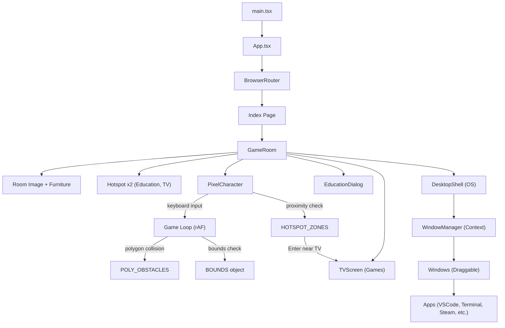

# Portfolio Project Documentation

> **Last Updated:** 2026-05-24  
> **Status:** Active development — Phase 3 complete (Desktop Shell)

---

## 1. Project Overview

This is an **interactive pixel-art portfolio website** built as a single-page application. The user experience is designed around a **cozy pixel-art room** where a controllable character can walk around and interact with objects — each mapped to a portfolio section or interactive feature.

### Core Concept
- A **pixel-art room** serves as the main view
- A **controllable character** moves via arrow keys or WASD
- A **TV & game console** lets users play retro games
- An **education certificate** on the wall shows degree & certifications
- A built-in **Collision Editor** (dev-only) supports polygon obstacle editing
- All collisions use **polygon-based ray-casting** for pixel-perfect isometric accuracy
- A full **Desktop Shell OS** interface simulating a computer with draggable windows and apps (Terminal, VS Code, Steam, Discord, Firefox, This PC).

---

## 2. Tech Stack

| Layer | Technology | Version |
|-------|-----------|---------|
| **Framework** | React | 18.3.x |
| **Language** | TypeScript | 5.8.x |
| **Build Tool** | Vite | 5.4.x (SWC plugin) |
| **Styling** | TailwindCSS | 3.4.x |
| **UI Primitives** | shadcn/ui (Radix) | Various |
| **Routing** | React Router DOM | 6.30.x |
| **State (Server)** | TanStack React Query | 5.83.x |
| **Fonts** | Press Start 2P, VT323 | Google Fonts |

---

## 3. Project Structure

```text
portfolio/
├── index.html                  
├── package.json                
├── vite.config.ts              
├── tailwind.config.ts          
├── tsconfig.json               
├── src/
    ├── main.tsx                
    ├── App.tsx                 
    ├── index.css               
    │
    ├── assets/                 # Pixel-art sprite images (room, player, furniture, app icons)
    │
    ├── components/
    │   ├── GameRoom.tsx         # Main room container, hotspots, dialogs, collision editor
    │   ├── PixelCharacter.tsx   # Player: movement, polygon collision, animation, freeze
    │   ├── TVScreen.tsx         # CRT TV overlay with retro games
    │   ├── CollisionEditor.tsx  # Dev tool: rect + polygon editor with furniture sizing
    │   ├── EducationDialog.tsx  # Education/certificate dialog
    │   ├── Hotspot.tsx          # Clickable overlay zones (rect or polygon SVG modes)
    │   ├── DesktopShell/        # OS Simulation Environment
    │   │   ├── DesktopShell.tsx # Main OS UI (desktop, icons, start menu)
    │   │   ├── WindowManager.tsx# Context provider for managing window states
    │   │   ├── Window.tsx       # Draggable/resizable window component
    │   │   ├── Taskbar.tsx      # Bottom taskbar with active apps
    │   │   ├── DesktopIcon.tsx  # Clickable desktop shortcut
    │   │   ├── apps/            # Virtual applications (VSCode, Terminal, Steam, Discord, Firefox, ThisPC)
    │   │   └── terminal/        # Terminal simulation commands logic
    │   └── ui/                  # shadcn/ui primitive components
    │
    ├── pages/
    │   ├── Index.tsx            # Home page
    │   └── NotFound.tsx         # 404 page
```

---

## 4. Architecture & Data Flow



---

## 5. Custom Components (Detail)

### 5.1 `GameRoom.tsx`
**The orchestrator component.** Renders the room image, furniture overlays, hotspot buttons, the player character, info dialogs, the TV screen, and the Desktop Shell.
- **Furniture:** Positioned via CSS percentages (TV at 61% top, Bean Bag at 4.4% left / 68.4% top).
- **Hotspots:** TV and Education hotspots use polygon-based SVG maps to exactly match their isometric visual shapes.

### 5.2 `PixelCharacter.tsx`
**The character controller.** Handles movement, animation, polygon collision detection, hotspot proximity, and freeze state.
- **Bounds:** Walkable area (X 1–97%, Y 59–99%).
- **Hotspot Zones:** `education` (center 85,67, radius 10), `tv` (center 9,75, radius 10).

### 5.3 `DesktopShell` & `WindowManager` (Phase 3)
A full operating system simulation environment accessed by interacting with the TV/PC.
- **WindowManager:** React Context managing the state of all open windows (Z-index, maximized, minimized, dimensions, positions).
- **DesktopShell:** Renders the background, desktop icons, start menu, context menu (right-click), and taskbar.
- **Window:** A draggable and resizable container for virtual apps.
- **Apps:**
  - **Terminal:** Interactive Linux-style CLI.
  - **VS Code:** Code editor simulation.
  - **Steam:** Game launcher (can trigger TV games).
  - **Discord:** Chat simulation.
  - **Firefox:** Browser simulation.
  - **This PC:** File explorer simulation.

---

## 6. Collision & Physics

### 6.1 Collision Detection
- **Primary:** Ray-casting **point-in-polygon** algorithm for `POLY_OBSTACLES`.
- **9 polygon obstacles** covering all room furniture in isometric perspective:
  1. Certificate
  2. Bed
  3. Desk
  4. Plant
  5. Shelf
  6. TV
  7. Chair
  8. Wall
  9. Desk corner (small triangular bound)

---

## 7. Roadmap & Next Steps

| Phase | Feature | Status |
|-------|---------|--------|
| Phase 1 | Room, Character, Hotspots, Collisions | ✅ Done |
| Phase 2 | TV & Games (Space Shooter, Snake, Pong) | ✅ Done |
| Phase 3 | Desktop Shell & Virtual Apps (WindowManager, Terminal) | ✅ Done |
| Refinement | Replace placeholder portfolio data with real info | ⏳ Waiting |
| Refinement | Mobile/touch controls | ⏳ Planned |
| Refinement | Character sit animation when interacting with TV | ⏳ Optional |

---

*This document will be updated as new features are implemented.*
